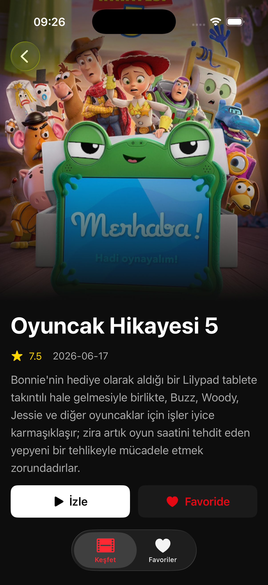
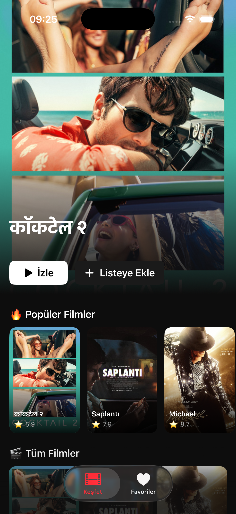

# 🎬 FilmApp

> A Netflix-inspired movie discovery app built with SwiftUI


## 📱 Screenshots

| Home | Detail | Favorite |
|------|--------|----------|
|  |  |  |

## ✨ Features

- 🎬 **Hero Banner** — Featured movie with cinematic poster
- 🔥 **Horizontal Scroll** — Popular movies section
- ⊞ **Grid Layout** — Browse all movies
- 🔍 **Real-time Search** — Search any movie instantly
- ❤️ **Favorites** — Save movies with SwiftData
- 🌙 **Dark Theme** — Netflix-inspired UI

## 🛠️ Tech Stack

| Technology | Usage |
|------------|-------|
| SwiftUI | UI Framework |
| async/await | Network Calls |
| TMDB API | Movie Data |
| SwiftData | Local Storage |
| MVVM | Architecture |

## 📁 Project Structure

```
FilmApp/
├── Models/
│   ├── Movie.swift
│   └── FavoriteMovie.swift
├── ViewModels/
│   └── MovieService.swift
├── Views/
│   ├── Home/
│   │   ├── HomeView.swift
│   │   ├── HeroBannerView.swift
│   │   └── MovieCardView.swift
│   ├── Detail/
│   │   └── MovieDetailView.swift
│   └── Favorites/
│       └── FavoritesView.swift
└── Utils/
    └── Theme.swift
```

## 🚀 Installation

1. Clone the repo
```bash
git clone https://github.com/52BaranHaydar/FilmApp.git
```

2. Get a free API key from [TMDB](https://www.themoviedb.org/settings/api)

3. Add your API key in `MovieService.swift`
```swift
private let apiKey = "YOUR_TMDB_API_KEY_HERE"
```

4. Run the project in Xcode

## 📋 Requirements

- iOS 17+
- Xcode 15+
- TMDB API Key

## 👨‍💻 Developer

**Baran Haydar**
[](https://linkedin.com/in/SENIN_LINKEDIN)
[](https://github.com/52BaranHaydar)
